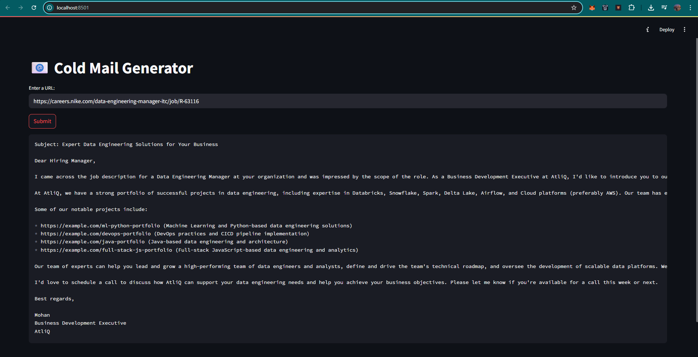

# 📫 Cold Mail Generator

The **Cold Mail Generator** is a Streamlit-powered web app that allows users to generate personalized cold emails for business development or outreach, based on job descriptions fetched from a careers page URL.

## 🚀 Features

- 🔗 Input a job posting URL from popular career websites.
- 🧠 Uses AI to analyze the job description and generate a professional cold email.
- 💼 Tailored for roles in data engineering, software development, AI, and tech consulting.
- ✨ Clean, dark-themed UI with one-click copy-paste support.

## 🖥️ Demo



## 🛠️ Tech Stack

- **Frontend/UI**: Streamlit
- **Backend**: Python, LangChain, Groq (LLM)
- **Prompt Engineering**: Role-based prompt templates
- **Other Tools**: `dotenv`, `os`, `requests` for modularity and scalability

## 📂 Directory Structure

```bash
cold-mail-generator/
├── app.py                 # Streamlit app entry point
├── chain.py               # LLM chain and prompt handling logic
├── .env                   # Contains API keys and secrets
├── requirements.txt       # Python dependencies
└── README.md              # You're here!